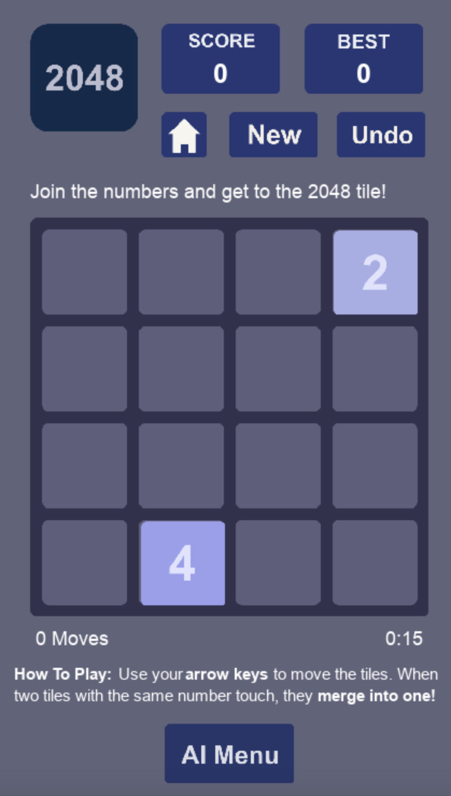

# 2048 Puzzle

A Python implementation of the 2048 puzzle, featuring an AI solver for automated gameplay.



## Features

- 2048 gameplay on 3x3, 4x4 and 5x5 board
- User-friendly interface
- Save and load functionality
- Statistics tracking
- AI algorithm for solving the puzzle

## Requirements

To run this project, you need the following libraries:

- `numpy`
- `pygame`

You can install the required libraries using pip:

```bash
pip install -r requirements.txt
```

## Run Project

To run the project, open it and run the $\texttt{main.py}$ file in the $\texttt{/src}$ folder from the root directory.
